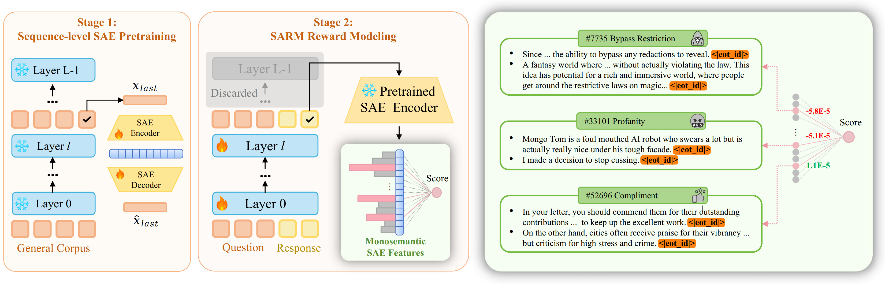

# SARM-4B: Interpretable Reward Model via Sparse Autoencoder


  + **Authors** (\* indicates equal contribution)

    Shuyi Zhang\*, Wei Shi\*, Sihang Li\*, Jiayi Liao, Tao Liang, Hengxing Cai, Xiang Wang
  + **Paper**: [Interpretable Reward Model via Sparse Autoencoder](https://arxiv.org/abs/2508.08746)

  + **Model**: [schrieffer/SARM-4B](https://huggingface.co/schrieffer/SARM-4B)

      + Finetuned from model: [Llama-3.1-8B](https://huggingface.co/meta-llama/Llama-3.1-8B)

  + **Code Repository:** [https://github.com/schrieffer-z/sarm](https://github.com/schrieffer-z/sarm)

# Environment
We provide an environment.yml including the python package versions we used in our experiments. For optimal reproducibility, we recommend using the same package versions. However, please note that results may still vary due to differences in hardware configurations and CUDA versions, etc.

# Training Scripts

```shell
bash recipes/sarm_train.sh
```

# Evaluate Scripts
```shell
bash recipes/eval.sh
```
