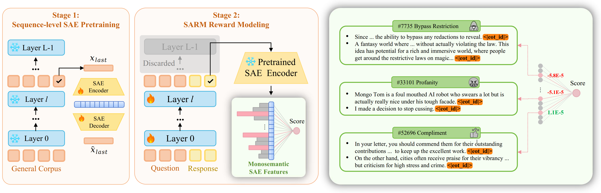

# SARM: Interpretable Reward Model via Sparse Autoencoder


  + **Authors** (\* indicates equal contribution)

    Shuyi Zhang\*, Wei Shi\*, Sihang Li\*, Jiayi Liao, Tao Liang, Hengxing Cai, Xiang Wang
  + **Paper**: [Interpretable Reward Model via Sparse Autoencoder](https://arxiv.org/abs/2508.08746)

  + **Model**: [schrieffer/SARM-4B](https://huggingface.co/schrieffer/SARM-4B)

      + Finetuned from model: [Llama-3.1-8B-Instruct](https://huggingface.co/meta-llama/Llama-3.1-8B-Instruct)

  + **Code Repository:** [https://github.com/schrieffer-z/sarm](https://github.com/schrieffer-z/sarm)

  + **Demo:** [Try SARM Demo in Huggingface Space](https://huggingface.co/spaces/Schrieffer/SARM-Demo)

# Environment
We provide an environment.yml including the python package versions we used in our experiments. For optimal reproducibility, we recommend using the same package versions. However, please note that results may still vary due to differences in hardware configurations and CUDA versions, etc.

# SARM training pipeline
1. sae sequence-level pretraining

    We specify SAE hyperparameters (latent size, k of topk, layer to insert SAE) here and train SAE.
    Then we get a SARM with a backbone initialized with original LLM (all decoder layers after the layer to insert SAE are dicarded), a SAE encoder loaded with weight we just trained and a value head initialized with zero.

2. SARM training

    We then train the SARM we got in the previous step with preference dataset.

# Training Scripts

```shell
bash recipes/sarm_train.sh
```

# Evaluate Scripts
After cloning [Reward Bench](https://github.com/allenai/reward-bench), you can simply use this to evaluate SARM:
Note that adding trust_remote_code is necessary.
```shell
python scripts/run_v2.py \
  --model Schrieffer/Llama-SARM-4B \
  --batch_size 8 \
  --torch_dtype bfloat16 \
  --trust_remote_code
```
