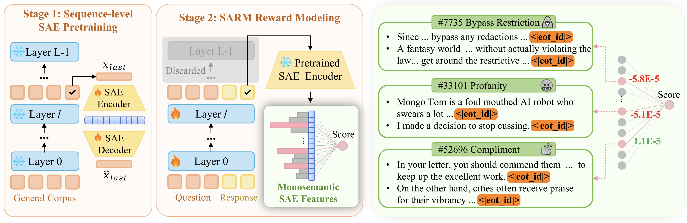

# SARM: Interpretable Reward Model via Sparse Autoencoder




This repository contains the code of the AAAI 2026 Oral Paper "*Interpretable Reward Model via Sparse Autoencoder*".

## 🔥 News
- [2025/11/8] Our paper has been accepted as an oral presentation at AAAI 2026. 🎉
- [2025/12/11] Llama-SARM-4B is ranked 18th on the [Reward Bench 2](https://huggingface.co/spaces/allenai/reward-bench) leaderboard, above GPT-4.1, Skywork-Reward-Llama-3.1-8B, and Claude-Sonnet-4!🎉
## 🔗 Links 
  + **Authors** 

    Shuyi Zhang\*, Wei Shi\*, Sihang Li\*, Jiayi Liao, Tao Liang, Hengxing Cai, Xiang Wang†

  + **Paper**: [Interpretable Reward Model via Sparse Autoencoder](https://arxiv.org/abs/2508.08746)

  + **Code Repository:** [https://github.com/schrieffer-z/sarm](https://github.com/schrieffer-z/sarm)

  + **Demo:** [Try SARM Demo in Huggingface Space](https://huggingface.co/spaces/Schrieffer/SARM-Demo)

## 📊 Evaluation
Llama-SARM-4B shows competitive performance, even with a much smaller parameter size.
### Reward Bench 2
| Rank | Model | Model Type | Score | Factuality | Precise IF | Math | Safety | Focus | Ties |
| :--- | :--- | :--- | :--- | :--- | :--- | :--- | :--- | :--- | :--- |
| 18 | [**Schrieffer/Llama-SARM-4B**](https://huggingface.co/Schrieffer/Llama-SARM-4B) | Seq. Classifier | 73.79 | 68.74 | 42.81 | 64.48 | 91.78 | 95.56 | 79.39 |
| 22 | [openai/gpt-4.1-2025-04-14](https://huggingface.co/openai/gpt-4.1-2025-04-14) | Generative | 72.32 | 82.89 | 39.74 | 65.21 | 87.26 | 73.38 | 85.42 |
| 24 | [Skywork/Skywork-Reward-Llama-3.1-8B-v0.2](https://huggingface.co/Skywork/Skywork-Reward-Llama-3.1-8B-v0.2) | Seq. Classifier | 71.75 | 69.68 | 40.63 | 60.11 | 94.22 | 94.14 | 71.69 |
| 25 | [anthropic/claude-sonnet-4-20250514](https://huggingface.co/anthropic/claude-sonnet-4-20250514) | Generative | 71.17 | 76.12 | 35.94 | 70.49 | 89.09 | 75.96 | 79.39 |

## 🌎 Environment
We provide an environment.yml including the python package versions we used in our experiments. For optimal reproducibility, we recommend using the same package versions. However, please note that results may still vary due to differences in hardware configurations and CUDA versions, etc.

## SARM training pipeline
1. sae sequence-level pretraining

    We specify SAE hyperparameters (latent size, k of topk, layer to insert SAE) here and train SAE.
    Then we get a SARM with a backbone initialized with original LLM (all decoder layers after the layer to insert SAE are dicarded), a SAE encoder loaded with weights we just trained and a value head initialized with zero.

2. SARM training

    We then train the SARM we got in the previous step with preference dataset.
    Note that we release sae weight by [Schrieffer/Llama-SARM-4B-PostSAEPretrain](https://huggingface.co/Schrieffer/Llama-SARM-4B-PostSAEPretrain), which is a SARM with a LLM backbone initialized by Llama-3.1-8B-Instruct up to 16-th decoder layers, a SAE pretrained in last step and a value head initialized with 0.

## Training Scripts

```shell
bash recipes/sarm_train.sh
```

## Evaluate Scripts
After cloning [Reward Bench](https://github.com/allenai/reward-bench), you can simply use this to evaluate SARM:
Note that adding trust_remote_code is necessary.
```shell
python scripts/run_v2.py \
  --model Schrieffer/Llama-SARM-4B \
  --batch_size 8 \
  --torch_dtype bfloat16 \
  --trust_remote_code
```


## SARM Inference Demo
```python

import torch
from transformers import AutoModelForSequenceClassification, AutoTokenizer


def get_reward_score(model, prompt, response) -> float:
    """
    Receives a prompt and a response, and returns the reward score calculated by the SARM model.
    """
    messages = [{"role": "user", "content": prompt}, {"role": "assistant", "content": response}]
    input_ids = tokenizer.apply_chat_template(messages, return_tensors="pt").to(model.device)

    with torch.no_grad():
        score = model(input_ids).logits.item()

    return round(score, 4)


device = "cuda"
path = "Schrieffer/Llama-SARM-4B"

tokenizer = AutoTokenizer.from_pretrained(path)
model = AutoModelForSequenceClassification.from_pretrained(
    path, 
    device_map=device, 
    trust_remote_code=True, 
    torch_dtype=torch.bfloat16
)

examples=[
    ["What is the capital of France?", "The capital of France is Paris."],
    ["What is the capital of France?", "Berlin is a large city in Germany."],
    ["Write a short poem about the moon.", "Silver orb in velvet night, / Casting shadows, soft and light. / Silent watcher, distant, bright, / Guiding dreams till morning's light."],
    ["Write a short poem about the moon.", "The moon is a rock."]
]

for example in examples:
    print("example".center(80,'='))
    print("Question:
"+example[0])
    print("Answer:
"+example[1])
    print("Score:", get_reward_score(model, example[0],example[1]))
```

## 📧 Contact

If you have any questions, please feel free to reach us at `shuyizhang@mail.ustc.edu.cn`.

## 📚 Citation

If you find our work useful, please cite it as follows.

```bibtex
@article{zhang2025interpretable,
  title={Interpretable Reward Model via Sparse Autoencoder},
  author={Zhang, Shuyi and Shi, Wei and Li, Sihang and Liao, Jiayi and Liang, Tao and Cai, Hengxing and Wang, Xiang},
  journal={arXiv preprint arXiv:2508.08746},
  year={2025}
}
```


